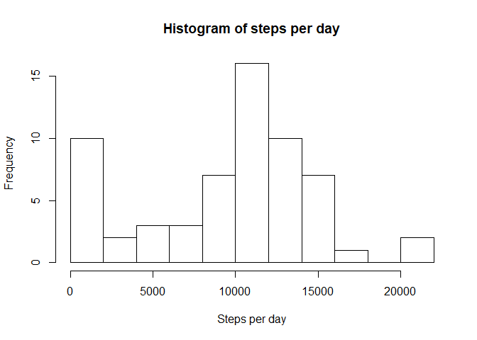
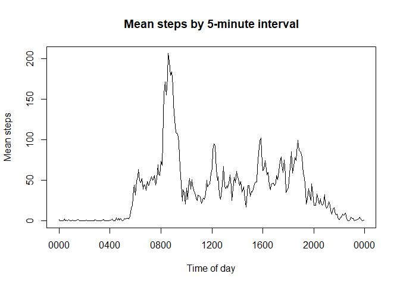
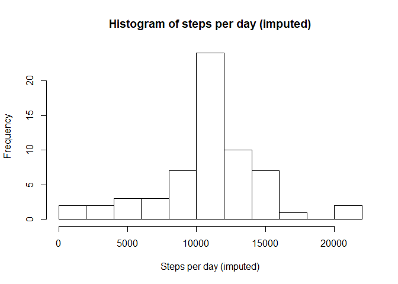
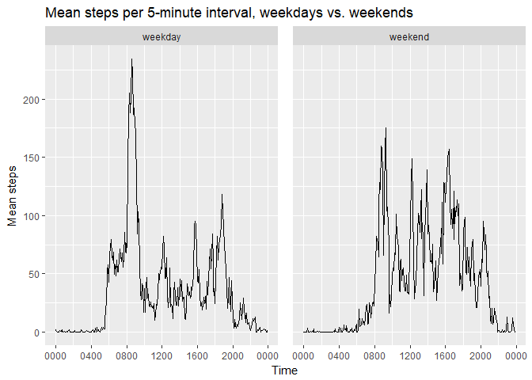

# Reproducible Research: Peer Assessment 1

It is now possible to collect a large amount of data about personal movement using activity monitoring devices such as a Fitbit, Nike Fuelband, or Jawbone Up. These type of devices are part of the "quantified self" movement - a group of enthusiasts who take measurements about themselves regularly to improve their health, to find patterns in their behavior, or because they are tech geeks. But these data remain under-utilized both because the raw data are hard to obtain and there is a lack of statistical methods and software for processing and interpreting the data.

This assignment makes use of data from a personal activity monitoring device. This device collects data at 5 minute intervals through out the day. The data consists of two months of data from an anonymous individual collected during the months of October and November, 2012 and include the number of steps taken in 5 minute intervals each day.

## Loading and preprocessing the data


```r
# Load the data (i.e. read.csv())
if (!file.exists("activity.csv")) {
  library(zip)
  unzip("activity.zip")
}
activityRaw <- read.csv("activity.csv", stringsAsFactors = FALSE)
```

The `interval` column of activityRaw is rendered in 24-hour "clock time", only with the leading zeroes chopped. I create a `minutes` column out of this, representing a five-minute chunk of the 1440 minutes in the day, to make the time scale uniform for graphing purposes. E.g., the `interval` 1200, representing noon, becomes "720", halfway through the day.

For future calculations, I also converted the `date` column to a date object.


```r
library(dplyr)
library(lubridate)
activity <- activityRaw %>%
  mutate(minutes = floor(interval / 100) * 60 + interval %% 100, date = ymd(date))
```


## What is mean total number of steps taken per day?

We begin with a histogram of steps taken per day over the period of measurement.


```r
stepsPerDay <- tapply(activity$steps, activity$date, sum, na.rm = TRUE)
hist(stepsPerDay, breaks=10, xlab="Steps per day", main="Histogram of steps per day")
```

<!-- -->

```r
meanStepsPerDay <- mean(stepsPerDay)
meanStepsPerDay
```

```
## [1] 9354.23
```

```r
medianStepsPerDay <- median(stepsPerDay)
medianStepsPerDay
```

```
## [1] 10395
```

Subject recorded a mean of 9354.2295082 and a median of 10395 steps per day. Days when no steps were recorded are included in this figure.

## What is the average daily activity pattern?


```r
fourHourLabels = c("0000","0400","0800","1200","1600","2000","0000")
stepsPerInterval <- tapply(activity$steps, activity$minutes, mean, na.rm = TRUE)

plot(names(stepsPerInterval), stepsPerInterval, type="l",xaxt="n", 
  main="Mean steps by 5-minute interval",
  xlab="Time of day",
  ylab="Mean steps")
axis(side = 1, at=seq(from=0, to=1440, by=240), labels = fourHourLabels)
```

<!-- -->

It appears mean steps activity peaks roughly between 8 and 9 in the morning. 


```r
# Which 5-minute interval, on average across all the days in the dataset, contains the maximum number of steps?
rowOfMax <- which.max(stepsPerInterval)
maxStepInterval <- activity$interval[rowOfMax]
# pad it out to 4 digits 
maxStepInterval <- sprintf("%04d", maxStepInterval)
maxStepInterval
```

```
## [1] "0835"
```

```r
maxStepFigure <- unname(stepsPerInterval[rowOfMax])
maxStepFigure
```

```
## [1] 206.1698
```

Specifically, the absolute peak is a mean of 206.1698113 steps at 0835.

## Imputing missing values


```r
# Calculate and report the total number of missing values in the dataset (i.e. the total number of rows with NAs)
totalCount <- nrow(activity)
totalCount
```

```
## [1] 17568
```

```r
missingDataCount <- nrow(activity[is.na(activity$steps),])
missingDataCount
```

```
## [1] 2304
```

2304 of 17568 observations are missing data for steps.

To get a better overall representation of the data over the entire period, I created a new column, `stepsImputed`, which takes either the recorded steps value or, in the case of NA, the overall mean steps recorded for that observation's interval.


```r
activity <- activity %>% 
  mutate(stepsImputed = ifelse(is.na(steps), stepsPerInterval[as.character(minutes)], steps))
```

Redoing our analysis of the daily sum of steps using the imputed data...


```r
stepsPerDayImputed <- tapply(activity$stepsImputed, activity$date, sum, na.rm = TRUE)
hist(stepsPerDayImputed, breaks=10, main="Histogram of steps per day (imputed)", xlab="Steps per day (imputed)")
```

<!-- -->

This looks a little closer to a normal distribution curve. The spike at the low end of the graph has disappeared, showing us that some days with apparently low activity simply had few or no readings.


```r
meanStepsPerDayImputed <- mean(stepsPerDayImputed)
meanStepsPerDayImputed
```

```
## [1] 10766.19
```

```r
medianStepsPerDayImputed <- median(stepsPerDayImputed)
medianStepsPerDayImputed
```

```
## [1] 10766.19
```

We see that imputing steps data in this way both raises the mean steps per day and makes it exactly equal to the median. This bears further investigation. What pattern are the NA values coming in?


```r
na_frequency <- activity %>% group_by(date) %>% summarize(missingIntervals = sum(is.na(steps)))
str(na_frequency)
```

```
## Classes 'tbl_df', 'tbl' and 'data.frame':	61 obs. of  2 variables:
##  $ date            : Date, format: "2012-10-01" "2012-10-02" ...
##  $ missingIntervals: int  288 0 0 0 0 0 0 288 0 0 ...
```

Do the NA data rows coincide exactly with a day of 288 intervals? That is, does every day contain either all data or none?


```r
unique(na_frequency$missingIntervals)
```

```
## [1] 288   0
```

Apparently that is the case: every day is either "full" of recorded data or completely "empty". 

This helps us understand how the mean and median came to be exactly the same. My imputation algorithm has simply filled a few empty days with the mean daily profile of days where steps were recorded, and it happens that one of these days comes to represent the median value. If the observations with missing step figures were more scattered, and not cut so cleanly across days, the imputed mean and median would almost certainly be different.

## Are there differences in activity patterns between weekdays and weekends?

We compare the daily activity profiles on weekdays with those on weekends.

First we create a new column `dayType` to specify whether the given date is a weekday or weekend. Then we summarize the steps activity by `dayType` and plot the two different profiles.


```r
library(ggplot2)
activity <- activity %>%
  mutate(dayType = factor(weekdays(date) %in% c("Saturday","Sunday"), labels = c("weekday", "weekend")))

dayTypeSummary <- activity %>%
  group_by(dayType, minutes) %>%
  summarize(meanSteps = mean(steps, na.rm = TRUE))

  ggplot(dayTypeSummary, aes(x = minutes, y = meanSteps)) + 
    scale_x_continuous(name = "Time", breaks = seq(0,1440, by=240), labels = fourHourLabels) +
    labs(y = "Mean steps", title = "Mean steps per 5-minute interval, weekdays vs. weekends") +
    theme(panel.spacing = unit(1, "lines")) +
    facet_grid(. ~ dayType) + 
    geom_line()
```

<!-- -->

We can see that activity starts later on the weekends; the 8:35 peak disappears; and in general periods of higher activity are more scattered throughout the day compared with a few noticeable peaks on weekdays. However, it is worth remembering that we have a smaller sample size of weekend data.
